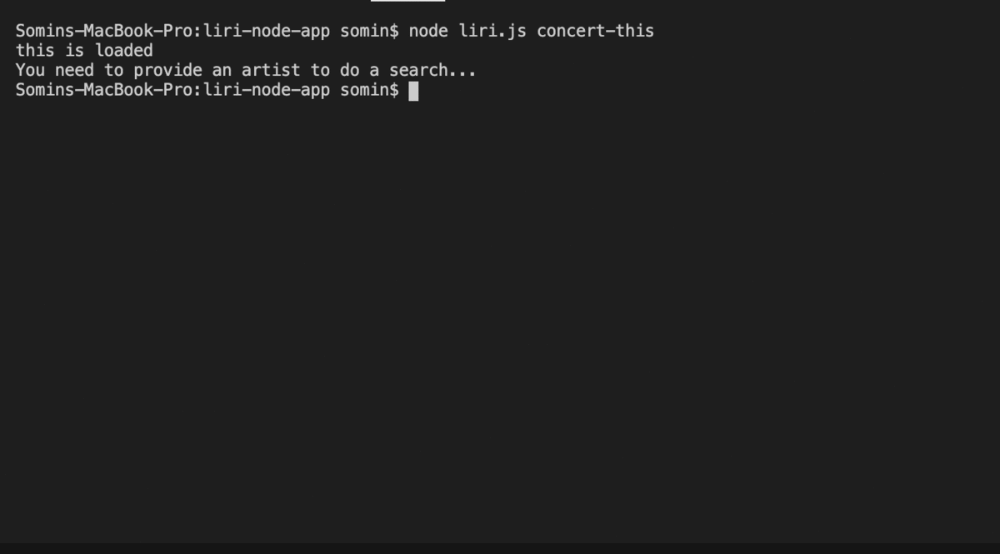
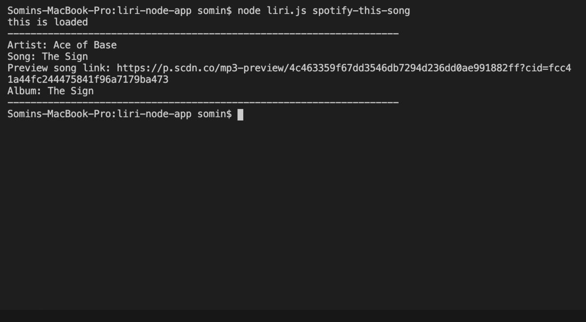
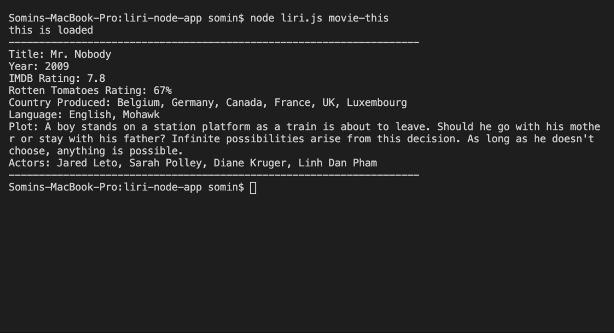
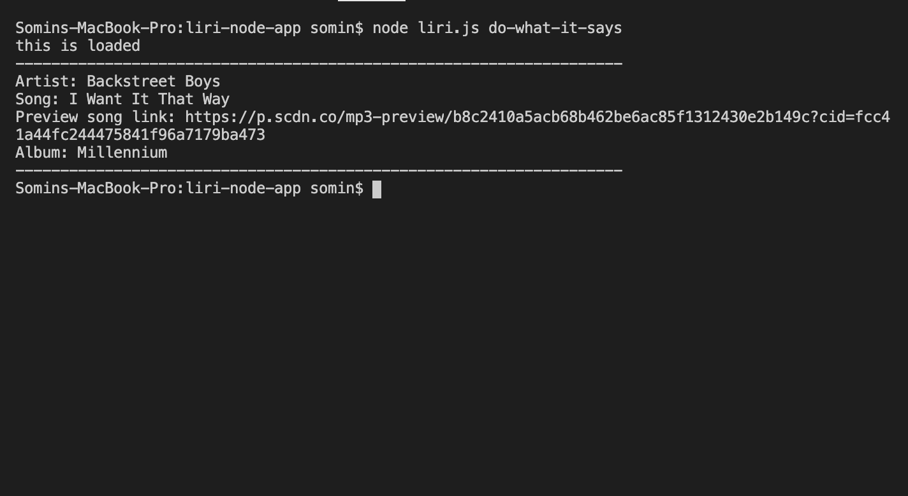

# liri-node-app (LIRI Bot)

### Introduction:
LIRI is a Language interpretation and Recognition Interface and a command line application using node app that takes in parameteres and gives you back data. LIRI was created to perform searches: Bands in Town for concerts, and OMDB for movies, Spotify for song tracks

### Setup:
1. Clone the repository
2. Run npm install, and the following packages should be installed:
   * [Node-Spotify-API](https://www.npmjs.com/package/node-spotify-api)
   * [Axios](https://www.npmjs.com/package/axios)
   * [Bands In Town API](http://www.artists.bandsintown.com/bandsintown-api)
   * [Moment](https://www.npmjs.com/package/moment)
   * [DotEnv](https://www.npmjs.com/package/dotenv)

### Instructions:
 
 1. `node liri.js concert-this <artist/band name here>` - This will return:

   * Name of the venue
   * Venue location
   * Date of the Event

2. `node liri.js spotify-this-song'<song name here>'` - This will return:

   * Artist(s)
   * Song Name
   * A preview link of the son
   * The album
   * If no song is provided the default is "The Sign" by Ace of Base.

3. `node liri.js movie-this '<movie name here>'` - This will return:

   * Title.
   * Year of release.
   * IMDB Rating.
   * Rotten Tomatoes Rating.
   * Country where the movie was produced.
   * Language of the movie.
   * Plot of the movie.
   * Actors in the movie.
   * If a movie isn't provided, a default movie, 'Mr. Nobody', will be used.

4. `node liri.js do-what-it-says`

   * LIRI use the commands listed in random.txt and then call one of LIRI's functions.
